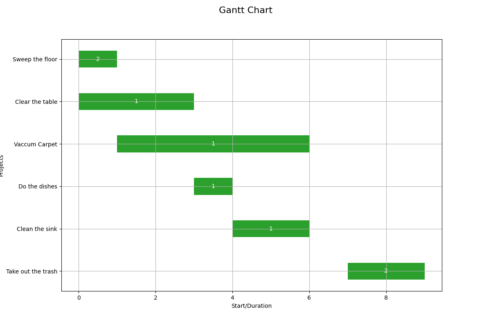

# gantt-solver
Scripts to generate Gantt charts given set of tasks with constraints

## Input

```json
{
  "max_resources_in_parallel": int,
  "projects": {
    "project-unique-id": {
      "name": string,
      "num_resources": int,
      "duration": int,
      "dependencies": [
        {
          "project_id": "depends-on-project-id",
          "lag_time": int
        }
      ]
    },
}
```

## Run example
```
python3 -m venv .venv
source .venv/bin/activate
pip3 install -r requirements.txt
cd examples
python3 ../gantt_solver/create_gantt_chart.py example-input.json example-output
open example-output.solution0.png
```

